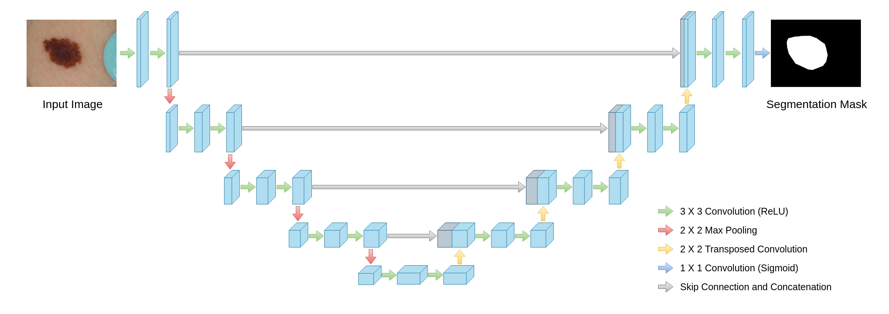
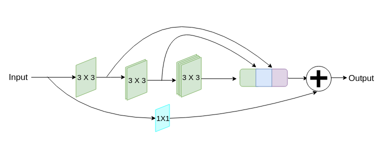
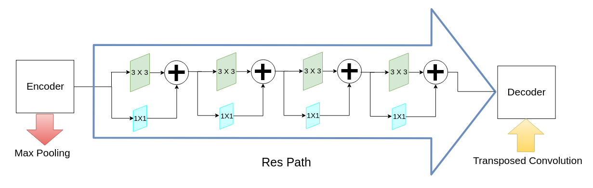
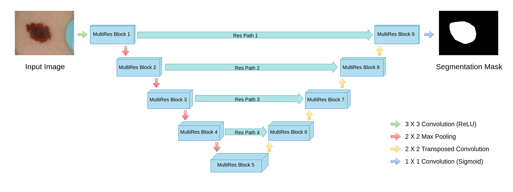

# MultiResUNet 
#### Rethinking the U-Net architecture for multimodal biomedical image segmentation

This repository contains the original implementation of "MultiResUNet : Rethinking the U-Net architecture for multimodal biomedical image segmentation" in Keras (Tensorflow as backend).

## Paper

MultiResUNet has been published in Neural Networks

>Ibtehaz, Nabil, and M. Sohel Rahman. "MultiResUNet: Rethinking the U-Net architecture for multimodal biomedical image segmentation." Neural Networks 121 (2020): 74-87.


* [Read the Paper](https://doi.org/10.1016/j.neunet.2019.08.025)
* [View the Preprint](https://arxiv.org/abs/1902.04049)

## Overview

In this project we take motivations from the phenomenal U-Net architecture for biomedical image segmentation and take an attempt to improve the already outstanding network.

<div style="text-align:center">
    
</div>


In order to incorporate multiresolution analysis, taking inspiration from Inception family networks, we propose the following *MultiRes* block, and replace the pair of convolutional layer pairs in the original U-Net with it. This configuration basically is derived from factorizing 5x5 and 7x7 convolution operations to 3x3 ones, and reusing them to obtain results from 3x3, 5x5 and 7x7 convolution operations simultaneously. Moreover, a residual path is also added.

<div style="text-align:center">
    
</div>


Consequnetly, to elleviate the likely semantic distance between Encoder and Decoder networks, we introduce *Res* Paths. We include additional convolutions along the shortcut path, in proportionate to the expected gap between the two corresponding layers.

<div style="text-align:center">
    
</div>


Therefore, with the fusion of *MultiRes* blocks and *Res* paths, we obtain the proposed architecture ***MultiResUNet***.

<div style="text-align:center">
    
</div>


## Codes

The model architecture codes can be found in

### Tensorflow
* [2D Model](https://github.com/nibtehaz/MultiResUNet/blob/master/tensorflow/MultiResUNet.py)

* [3D Model](https://github.com/nibtehaz/MultiResUNet/blob/master/tensorflow/MultiResUNet3D.py)

### Pytorch
* [2D Model](https://github.com/nibtehaz/MultiResUNet/blob/master/pytorch/MultiResUNet.py)

* [3D Model](https://github.com/nibtehaz/MultiResUNet/blob/master/pytorch/MultiResUNet3D.py)


## Demo

A demo can be found in [here](https://github.com/nibtehaz/MultiResUNet/blob/master/tensorflow/Demo.ipynb) (tensorflow)


## License
[](http://badges.mit-license.org)

[MIT license](https://github.com/nibtehaz/MultiResUNet/blob/master/LICENSE)


## Citation Request

If you use ***MultiResUNet*** in your project, please cite the following paper

```
@article{ibtehaz2020multiresunet,
  title={MultiResUNet: Rethinking the U-Net architecture for multimodal biomedical image segmentation},
  author={Ibtehaz, Nabil and Rahman, M Sohel},
  journal={Neural Networks},
  volume={121},
  pages={74--87},
  year={2020},
  publisher={Elsevier}
}
```